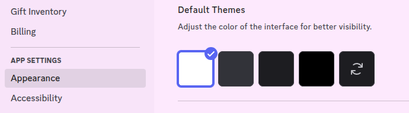
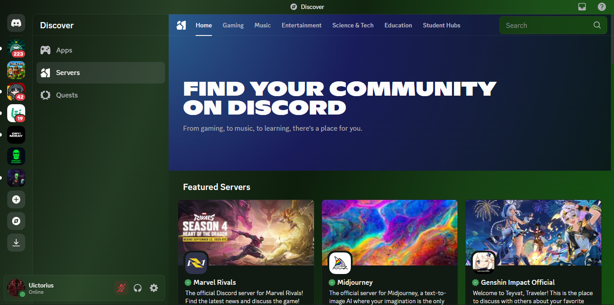
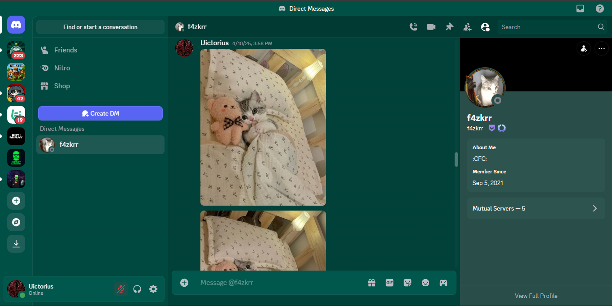
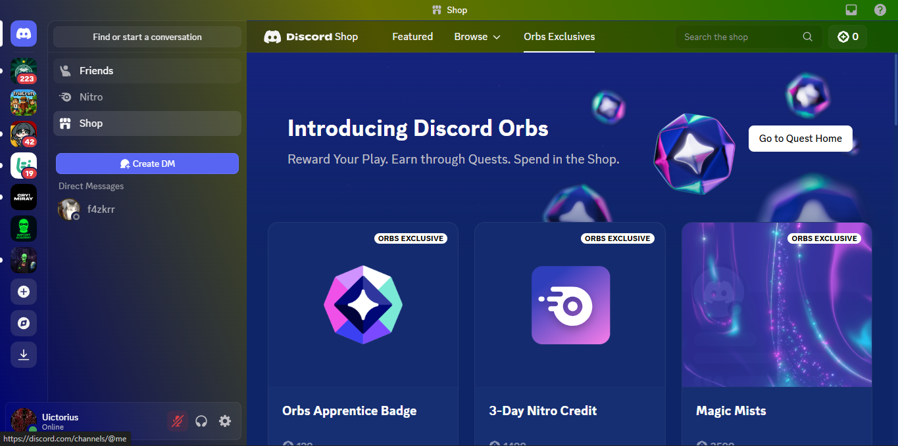
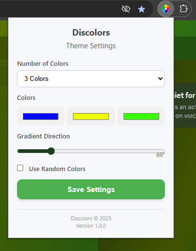

# Discolors ✨: The Custom Theming Engine for Discord

[](https://opensource.org/licenses/MIT)


[](https://github.com/uictorius/discolors/actions/workflows/main.yml)
[](https://nodejs.org/)

**Discolors** is a high-performance Chrome extension built with **TypeScript** and **Vite** that enables full customization of the Discord web client. Move beyond standard dark/light modes with **personalized gradients, color palettes, and persistent theming**.

🔑 **Zero Data Collection** — All processing and storage happen **locally in your browser**, ensuring your privacy.

---

## 🚀 Installation

We recommend installing via the packaged CRX file for convenience, or using the ZIP method for development/testing.

### Latest Release

| Package Type          | Download Link                                                                                 | Description                           |
| :-------------------- | :-------------------------------------------------------------------------------------------- | :------------------------------------ |
| **CRX (Recommended)** | [Download CRX](https://github.com/uictorius/discolors/releases/latest/download/discolors.crx) | Installable package for Chrome.       |
| **ZIP (Unpacked)**    | [Download ZIP](https://github.com/uictorius/discolors/releases/latest/download/discolors.zip) | Use with "Load unpacked" in Dev Mode. |

### Installation Guide

1. Download and **extract** the `.zip` package.
2. Open **`chrome://extensions`**.
3. Enable **Developer Mode**.
4. Click **Load unpacked** and select the extracted folder.

> Once installed, click the extension icon in your toolbar to configure themes and instantly apply them to Discord.

---

## ⚙️ Settings

### Dark or Light Themes

This extension automatically recognizes the **Dark** and **Light** themes.

If you want to use light or dark colors, you'll need to change your theme in your Discord settings.

**Here's how:**

`User Settings` $\rightarrow$ `Appearance` $\rightarrow$ **Theme**



---

## ✨ Features

Discolors combines **flexibility, performance, and privacy** by leveraging **CSS Variables** and **Mutation Observers**.

| Feature               | Description                                                          | Implementation Details                                                      |
| :-------------------- | :------------------------------------------------------------------- | :-------------------------------------------------------------------------- |
| **Custom Gradients**  | Apply rich, multi-color gradients to Discord’s background.           | Supports up to **5 colors** with adjustable directions (0°–360°).           |
| **Dynamic Palettes**  | Instantly refresh Discord’s look with randomly generated color sets. | Pure in-browser color generation.                                           |
| **Theme Persistence** | Keep your theme active even as Discord dynamically changes views.    | Uses **MutationObserver** in the Content Script.                            |
| **Modern Stack**      | Built with modern tooling for performance and maintainability.       | **TypeScript** + **Vite** + **Sass**, ensuring type safety and fast builds. |

---

## 🔒 Privacy

- **No tracking or analytics**
- **All data stored locally** in `chrome.storage`
- **Fully open-source** under MIT License

---

## 🖼️ Screenshots

**Discover page theme**


**Direct messages**


**Shop page**


**Popup interface**



---

## 💻 Developer Setup

If you want to **run, test, or contribute** to Discolors:

### Initial Setup

```bash
# Clone the repository
git clone https://github.com/uictorius/discolors.git
cd discolors

# Install dependencies
npm install
```

### Available Scripts

| Script                      | Command                            | Description                                                                                                                     |
| :-------------------------- | :--------------------------------- | :------------------------------------------------------------------------------------------------------------------------------ |
| **`npm run dev`**           | `vite`                             | Starts the **Vite dev server** with **HMR** for immediate development feedback.                                                 |
| **`npm run build`**         | `vite build`                       | Compiles the production-ready extension files to the `build/discolors` directory.                                               |
| **`npm run lint`**          | `eslint src`                       | Runs the linter (ESLint/TypeScript) to check for code quality and potential bugs.                                               |
| **`npm run format`**        | `prettier --write "src/**/..."`    | Automatically formats the entire codebase using Prettier.                                                                       |
| **`npm run release`**       | `standard-version`                 | Creates the release commit and Git tag, but **does not** sync the build files.                                                  |
| **`npm run build-package`** | `node package-extension.mjs`       | Generates the **`.crx` and `.zip`** distribution files using the private key.                                                   |
| **`npm run version-sync`**  | `npm run release && npm run build` | Executes version bumping, creates the tag, and immediately runs `npm run build` to synchronize version numbers in the manifest. |

---

## 🚀 Recommended Release Workflow

The entire release process is triggered locally via your `version-sync` or `release` script, ensuring the version in `package.json` is properly synced to the build artifacts before publishing.

### Key Requirement: Conventional Commits

Before running the release script, make sure all new features and fixes are committed using **Conventional Commit** prefixes (`feat:`, `fix:`, `chore:`, etc.). `standard-version` uses these commit messages to determine the next semantic version number (e.g., `1.0.0` → `1.0.1`).

| Step                     | Command                                                    | Purpose                                                                                                                                                                                                                                |
| :----------------------- | :--------------------------------------------------------- | :------------------------------------------------------------------------------------------------------------------------------------------------------------------------------------------------------------------------------------- |
| 1. **Develop**           | `npm run dev`                                              | Start the development server and implement your code changes.                                                                                                                                                                          |
| 2. **Finalize Code**     | `npm run format && npm run lint`                           | Ensure code quality and consistent style across all modified files.                                                                                                                                                                    |
| 3. **Commit Changes**    | `git add .` <br> `git commit -m "feat: add new feature X"` | **Add and commit all completed features/fixes** using the required **Conventional Commit** format.                                                                                                                                     |
| 4. **Version & Sync**    | `npm run version-sync` or `npm run release`                | **Automates the release:** bumps the version (e.g., `1.0.1`), updates `CHANGELOG.md`, creates the **release commit and Git tag**, and runs `npm run build` to **sync the new version** into `manifest.json` and other build artifacts. |
| 5. **Package Artifacts** | `npm run build-package`                                    | Creates the final, versioned **`.crx` and `.zip`** files from the synchronized build directory.                                                                                                                                        |
| 6. **Deploy**            | `git push --follow-tags origin main`                       | Pushes the release commit and the new tag to GitHub, triggering the CI/CD pipeline (`main.yml`) to create the official GitHub Release and attach the built artifacts.                                                                  |

---

### Example Workflow

1. **Stage changes**

```bash
git add .
```

2. **Commit changes with Conventional Commit format**

```bash
git commit -m $'refactor!: restructure project into modular architecture with TypeScript and Vite'
```

3. **Generate release and update version/package.json/manifest.json/CHANGELOG**

```bash
npm run release
```

4. **Push commits and tag to GitHub**

```bash
git push --follow-tags origin main
```

---

## 🏗️ Project Structure

```text
discolors/
├── eslint.config.js
├── LICENSE
├── package-extension.mjs
├── package.json
├── package-lock.json
├── README.md
├── screenshots
│   ├── screenshot-discover.png
│   ├── screenshot-dm.png
│   ├── screenshot-extension.png
│   └── screenshot-shop.png
├── src
│   ├── assets
│   │   └── icons
│   │       ├── 128x128.png
│   │       ├── 16x16.png
│   │       └── 48x48.png
│   ├── manifest.json
│   ├── scripts
│   │   ├── background
│   │   │   └── index.ts
│   │   ├── content
│   │   │   └── index.ts
│   │   ├── popup
│   │   │   └── main.ts
│   │   └── shared
│   │       ├── constants.ts
│   │       ├── storage.ts
│   │       ├── types.ts
│   │       └── utils.ts
│   ├── styles
│   │   └── popup.scss
│   └── ui
│       └── popup.html
├── tsconfig.json
├── tsconfig.node.json
└── vite.config.ts
```

---

## 🤝 Contributing

Contributions are welcome! Please follow these guidelines to ensure consistency across the project:

1. **Fork** the repository and create a new branch for your feature or fix.
2. Before committing, always run:
   ```bash
   npm run format && npm run lint
   ```

---

## 📄 License

MIT License — see [LICENSE](LICENSE) for details.
