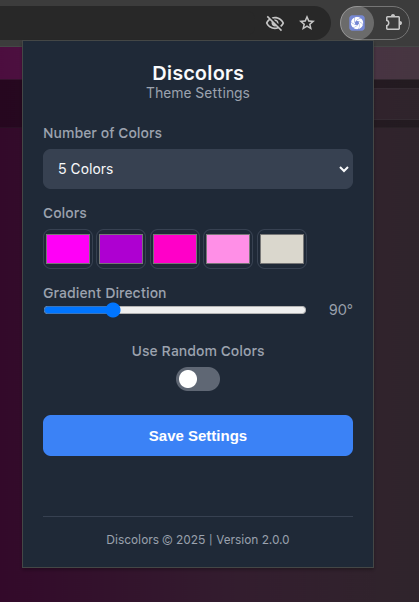

# Discolors - Custom Discord Themes Extension

[](https://opensource.org/licenses/MIT)  


A lightweight Chrome extension that lets you apply custom themes and colorful gradients to Discord. All processing happens locally in your browser — no data leaves your device.

---

## 🔍 Important Disclaimers

### 🚫 Not Official
**This is NOT an official Discord product**  
Discolors is independently developed and not affiliated with Discord, Inc. "Discord" is a registered trademark of Discord, Inc.

### 🔒 Privacy
**We do not collect any data**  
- No tracking  
- No analytics  
- No personal information stored  
- No third-party requests  

---

## ✨ Features

| Feature | Description |
|---------|-------------|
| 🎨 Custom Colors | Apply up to 5 custom colors or a single color |
| 🌈 Gradient Support | Create linear gradients with adjustable angles |
| 🔀 Random Colors | Automatically generate random color themes |
| 🖥️ Local Processing | All changes are applied in your browser only |
| 🆓 Free & Open Source | MIT license, fully transparent code |

---

## 🖼️ Screenshots

**Discover page theme example**  


**Direct messages theme example**  


**Shop page theme example**  


---

## 🛠️ Installation

### Chrome/Edge (Manual Installation)
1. Download or clone this repository  
2. Open `chrome://extensions` in your browser  
3. Enable **Developer mode** (top-right toggle)  
4. Click **Load unpacked**  
5. Select the `Discolors` folder  

---

## 🖥️ Usage
1. Click the Discolors icon in your toolbar  
2. Adjust the **Number of Colors**, **Colors**, **Gradient Direction**, or enable **Random Colors**  
3. Click **Save Settings**  
4. The theme will immediately apply to Discord pages in your browser  

**Popup interface example:**  


---

## 🏗️ File Structure
```text
Discolors/
├── icons/                  # Extension icons
│   ├── 16x16.png           # Toolbar icon
│   ├── 48x48.png           # Extension icon
│   └── 128x128.png         # Store icon
├── screenshots/            # Demo screenshots
│   ├── screenshot-discover.png
│   ├── screenshot-dm.png
│   ├── screenshot-shop.png
│   └── screenshot-extension.png
├── manifest.json           # Extension configuration
├── popup.html              # Popup UI
├── popup.js                # Popup logic
├── content.js              # Theme application script
├── background.js           # Background tasks (update checker)
└── LICENSE                 # MIT license
```

## 📄 License
MIT License - See [LICENSE](LICENSE) for full text